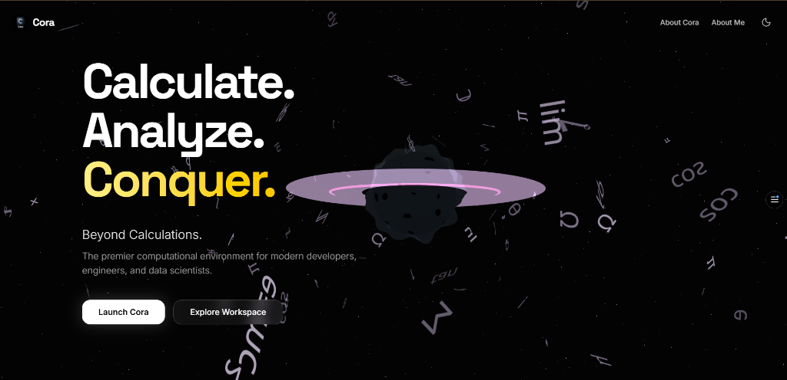
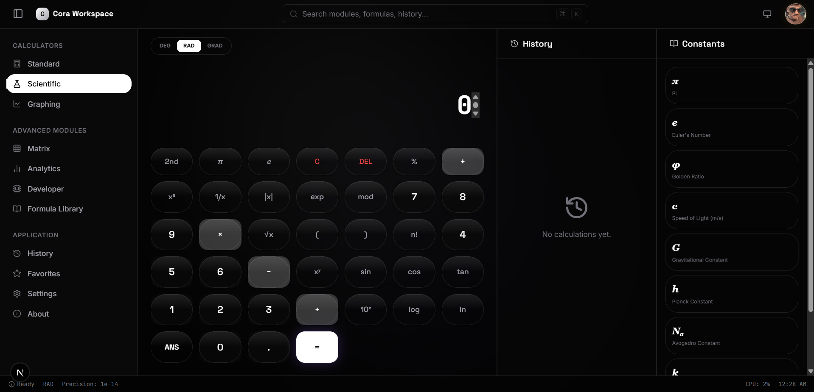
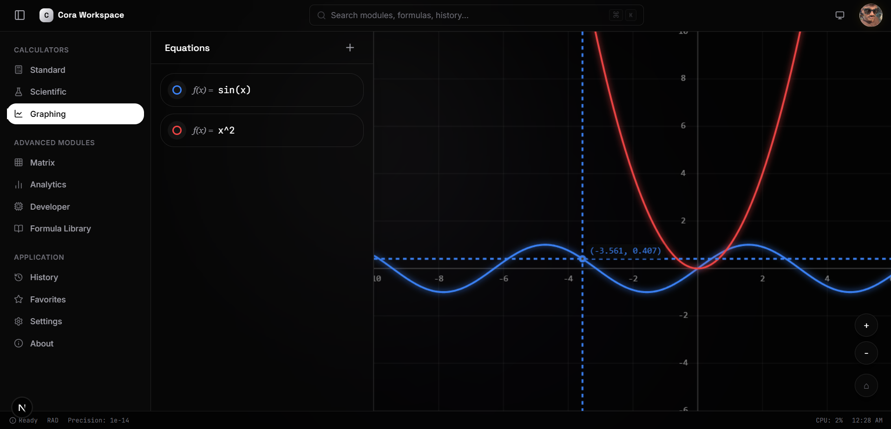
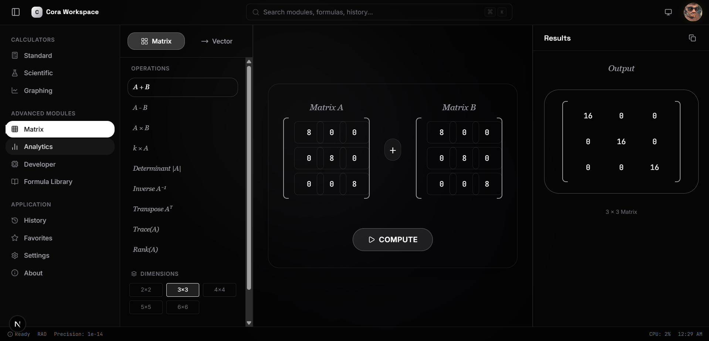
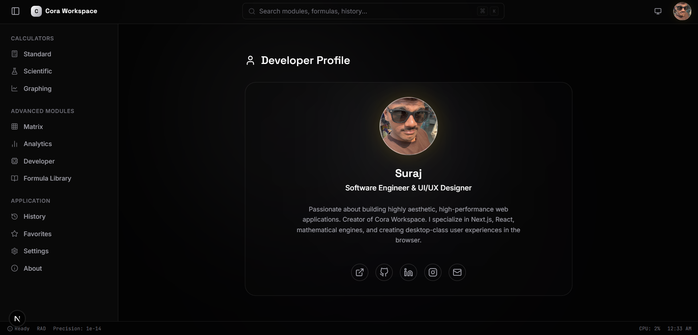
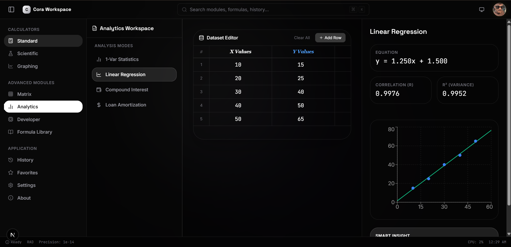
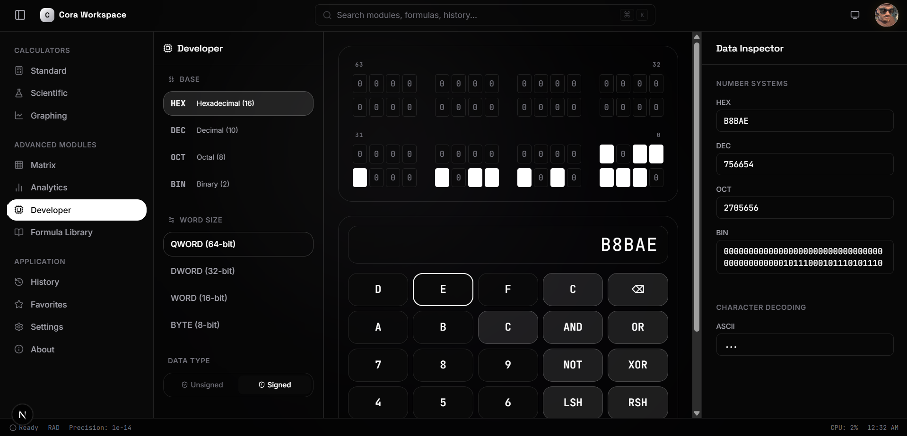
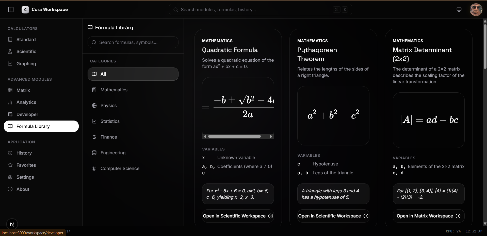
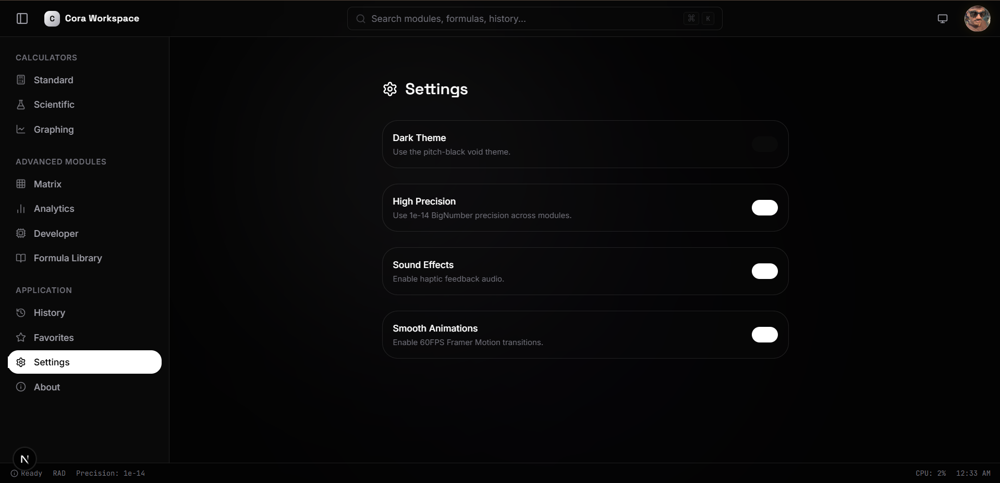

<div align="center">
  
  <h1>Cora Workspace</h1>
  <p><strong>The premier computational environment for modern developers, engineers, and data scientists.</strong></p>
  
  <p>
    
    
    
    
    
  </p>

  <h3><a href="https://cora-wine.vercel.app/">🚀 View Live Application</a></h3>
</div>

<br />

> **Cora** is an ultra-premium, modular calculator and computational workspace built with Next.js App Router, TailwindCSS, and Framer Motion. It features a custom AST-parsing math engine and a completely bespoke WebGL 3D environment.

---

## 🚀 Features

Cora is not just a calculator; it is an entire computational operating system containing six distinct advanced modules:

* 🧮 **Standard & Scientific**: Precision mathematical environments powered by `mathjs` with BigNumber support (no `0.1 + 0.2 = 0.300000004` errors).
* 📈 **Graphing Engine**: Real-time Cartesian coordinate plotting with dynamic viewport panning, zooming, and multi-equation rendering using HTML5 Canvas.
* 🔢 **Matrix Operations**: Full Linear Algebra suite supporting up to 6x6 matrices. Compute Determinants, Inverses, Transposes, and Matrix Multiplication seamlessly.
* 📊 **Analytics & Finance**: Advanced statistics, linear regression, loan amortization schedules, and compound interest graphing powered by `recharts`.
* 💻 **Developer Mode**: Instant Binary, Octal, Decimal, and Hexadecimal conversions with a visual Bit-Toggling Grid for low-level systems programming.
* 🌌 **WebGL 3D Landing Experience**: A breathtaking, dynamic hero section featuring a custom 3D environment built with `@react-three/fiber` and post-processing bloom.

---

## 📸 Showcase

*(Screenshots provided from the live application)*

### Landing Experience


### Standard & Scientific Calculator


### Graphing Engine


### Matrix Mathematics


### Developer Profile


### Analytics & Statistics


### Developer Tools


### Formula Library


### Settings & Theming


*(Feel free to add more screenshots to the `public/docs/` folder!)*

---

## 🏗️ Architecture

Cora is engineered for absolute performance and reliability:

1. **State Management**: Zero prop-drilling. Global state is managed efficiently using `Zustand`, divided into specific store slices (`calcStore`, `graphStore`, `matrixStore`, `analyticsStore`).
2. **Math Engine Integration**: Custom wrapper around `mathjs` ensuring strict AST sanitization. All calculations happen synchronously with sub-millisecond latency.
3. **Performance Optimization**: 
   - Heavy components (like the WebGL Scene and Recharts) are **Dynamically Imported** (`next/dynamic`) to completely eliminate them from the initial SSR payload.
   - UI elements are aggressively memoized with `React.memo` to prevent re-renders on every keystroke.
4. **Theming**: Dark/Light mode is powered by `next-themes` with a strictly enforced hydration strategy to prevent Server/Client DOM mismatches.

---

## 💻 Tech Stack

- **Framework:** [Next.js 15](https://nextjs.org/) (App Router, Turbopack)
- **Styling:** [Tailwind CSS v3](https://tailwindcss.com/)
- **Animations:** [Framer Motion](https://www.framer.com/motion/)
- **State Management:** [Zustand](https://zustand-demo.pmnd.rs/)
- **3D Rendering:** [React Three Fiber](https://docs.pmnd.rs/react-three-fiber/) & Drei
- **Math Engine:** [Math.js](https://mathjs.org/)
- **Charts:** [Recharts](https://recharts.org/)
- **Icons:** [Lucide React](https://lucide.dev/)

---

## ⚙️ Getting Started

### Prerequisites
- Node.js (v18+)
- npm or pnpm

### Installation

1. Clone the repository:
   ```bash
   git clone https://github.com/daystar-1nine/CodeAlpha_Cora.git
   cd CodeAlpha_Cora
   ```

2. Install dependencies:
   ```bash
   npm install
   ```

3. Start the development server:
   ```bash
   npm run dev
   ```

4. Open your browser and navigate to `http://localhost:3000`.

---

## 🛡️ License
Built for the CodeAlpha Internship Program. 

<div align="center">
  <sub>Engineered with precision and elegance.</sub>
</div>
