<div align="center">
  
  
  # CORA
  ### The Next-Generation Mathematical Operating System & Computational Workspace
  
  <p>
    <strong>A desktop-class, mobile-first scientific computing environment engineered with Next.js 15, React 19, Tailwind CSS v4, and bespoke Three.js WebGL graphics.</strong>
  </p>

  <p>
    <a href="https://cora-wine.vercel.app/"></a>
    
    
    
    
    
    
  </p>

  <p>
    <a href="#-features">Features</a> •
    <a href="#-visual-showcase">Showcase</a> •
    <a href="#-mobile-first-experience">Mobile Experience</a> •
    <a href="#%EF%B8%8F-architecture--engineering">Architecture</a> •
    <a href="#-tech-stack">Tech Stack</a> •
    <a href="#-getting-started">Getting Started</a>
  </p>
</div>

---

## 🌟 Overview

**Cora** is a high-performance computational workspace designed for developers, data scientists, aerospace & electrical engineers, and mathematicians. Unlike standard calculator utilities, Cora treats computation as an integrated workstation experience. 

It combines arbitrary-precision arithmetic, dynamic real-time function graphing, full matrix linear algebra, statistical regression modeling, financial loan amortization, low-level bitwise manipulation, and a LaTeX-rendered formula library into a unified glassmorphic application.

> **🔗 Production Deployment:** [https://cora-wine.vercel.app/](https://cora-wine.vercel.app/)

---

## 🚀 Modules & Capabilities

Cora is engineered as a modular suite of specialized computational workspaces:

### 1. 🧮 Standard & Scientific Calculator
* **Arbitrary Precision:** Built on top of `mathjs` with BigNumber support to eliminate floating-point imprecision (e.g. `0.1 + 0.2 = 0.3`).
* **Advanced Math:** Trigonometric, hyperbolic, logarithmic, factorial, permutation, combination, and exponential expressions.
* **Auto-Scaling Display:** Dynamically resizes long mathematical expressions and calculations without horizontal overflow.
* **Memory Registers:** Full memory manipulation suite (`MC`, `MR`, `M+`, `M-`, `MS`).

### 2. 📈 Real-Time Graphing Studio
* **HTML5 Canvas Renderer:** Smooth, 60fps real-time Cartesian function plotting with dynamic DPI awareness.
* **Simultaneous Multi-Equation:** Plot unlimited equations simultaneously with dynamic color mapping and glowing neon traces.
* **Interactive Inspection:** Hover-based crosshair tooltips calculate coordinates and curve tangents on the fly.
* **Touch & Trackpad Gestures:** Native pinch-to-zoom, two-finger pan, and double-tap viewport reset.

### 3. 🔢 Linear Algebra & Matrix Laboratory
* **Matrix Operations:** Supports arbitrary dimensions up to 6×6 matrices. Compute Inverses, Transposes, Determinants, Rank, and Matrix Products.
* **Vector Mechanics:** Perform Dot Products, Cross Products, Vector Magnitudes, Angles, and Projections.
* **Touch-Friendly Grid:** Large editable matrix cells with horizontal scroll protection for mobile and tablet devices.

### 4. 📊 Analytics, Statistics & Finance Suite
* **1-Variable Statistics:** Mean ($\mu$), Standard Deviation ($\sigma$), Median, Quartiles, Variance, and dynamic bar distribution charts.
* **2-Variable Linear Regression:** Computes slope ($m$), intercept ($b$), correlation coefficient ($r$), and coefficient of determination ($R^2$).
* **Finance Modeling:** Loan Amortization schedule generator with breakdown of monthly EMI, total interest, and Compound Interest projection curves.

### 5. 💻 Systems Developer Console
* **Multi-Base Real-Time Conversion:** Synchronized conversion across Hexadecimal (HEX), Decimal (DEC), Octal (OCT), and Binary (BIN).
* **Interactive 64-Bit BitGrid:** Clickable bit toggles grouped into 4-bit nibbles for 8-bit, 16-bit, 32-bit, and 64-bit word sizes.
* **Character Decoding:** Live ASCII and Unicode character inspector with Signed/Unsigned two's complement modes.

### 6. 📚 Interactive Formula Library
* **LaTeX Formula Rendering:** Crisp typography rendered with `KaTeX` and `react-latex-next`.
* **Cross-Disciplinary Coverage:** Hundreds of curated formulas across Mathematics, Physics, Statistics, Finance, and Computer Science.
* **Deep Workspace Linking:** Tap any formula to jump directly into its corresponding calculator workspace.

### 7. 🌌 Cinematic WebGL Landing Experience
* **Three.js & React Three Fiber:** Bespoke 3D cosmic background featuring an interactive black hole, accretion disk, and orbiting mathematical glyphs.
* **Adaptive DPR & Battery Conservation:** Intelligently reduces particle counts and geometry complexity on mobile devices to preserve frame rates and battery life.

---

## 📸 Visual Showcase

<div align="center">

### 🌌 3D Cosmic Landing Experience
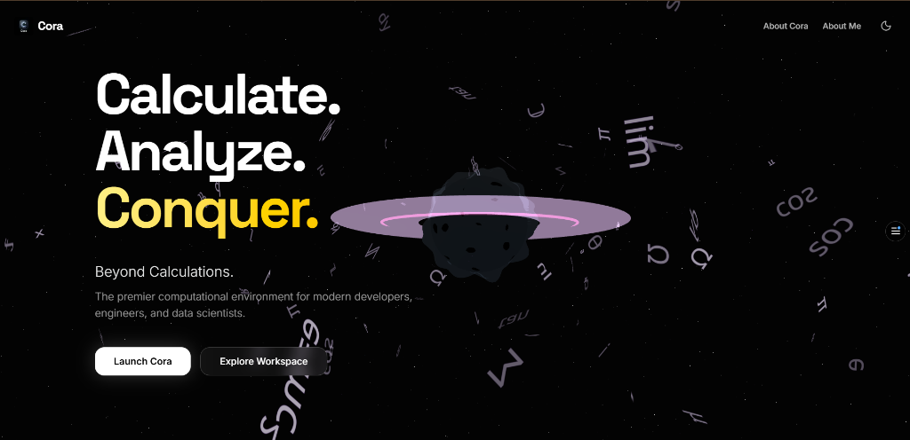
<p><em>Immersive Three.js WebGL hero with interactive particle physics and fluid typography.</em></p>

---

### 🧮 Standard Calculator
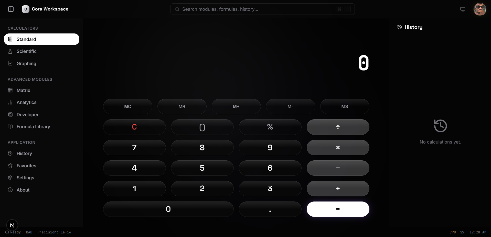
<p><em>Clean, distraction-free computational layout with live history and memory indicators.</em></p>

---

### 🔬 Scientific Computing Studio
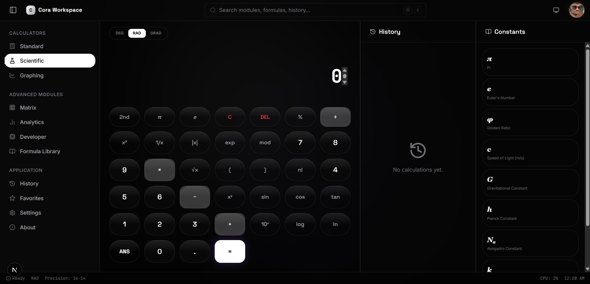
<p><em>Full-featured scientific keyboard layout with auto-scaling dynamic typography.</em></p>

---

### 📈 Real-Time Graphing Studio
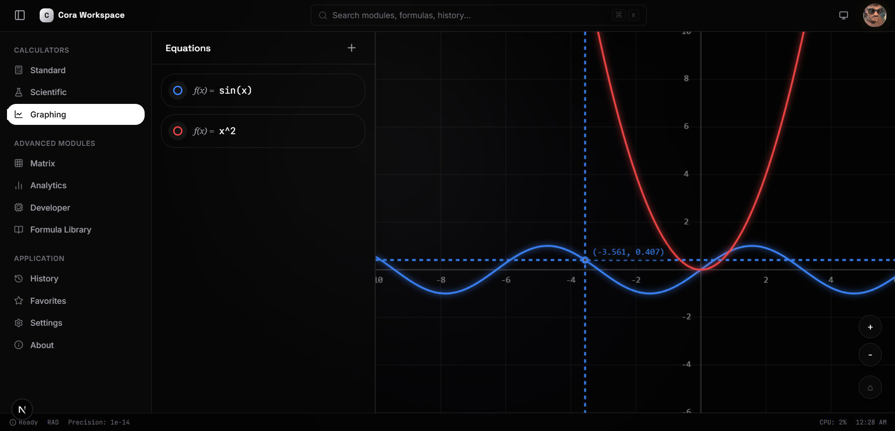
<p><em>Multi-curve Cartesian plotter with interactive inspection crosshairs and zoom controls.</em></p>

---

### 🔢 Matrix & Linear Algebra Laboratory
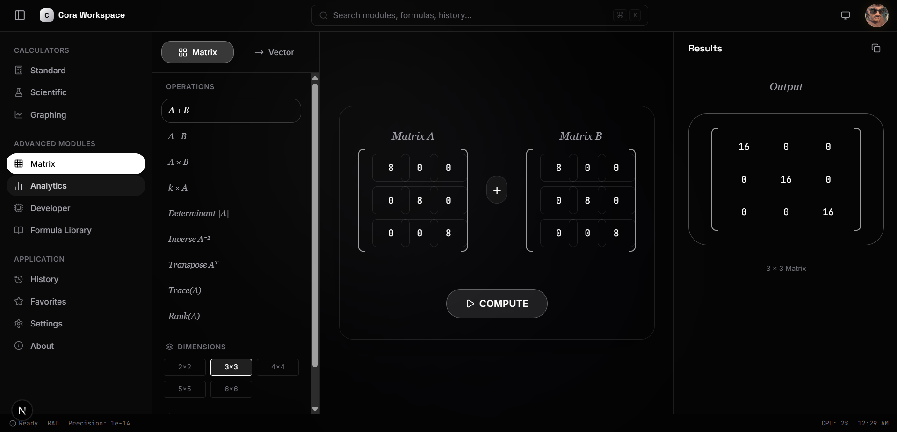
<p><em>Full vector and matrix manipulation suite with dynamic row/column sizing.</em></p>

---

### 📊 Analytics & Statistical Modeling
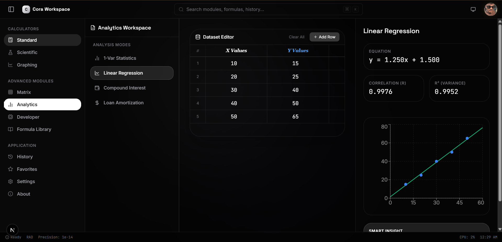
<p><em>Dataset spreadsheet with live 1-Var/2-Var stats, linear regression, and financial amortization.</em></p>

---

### 💻 Systems Developer Console
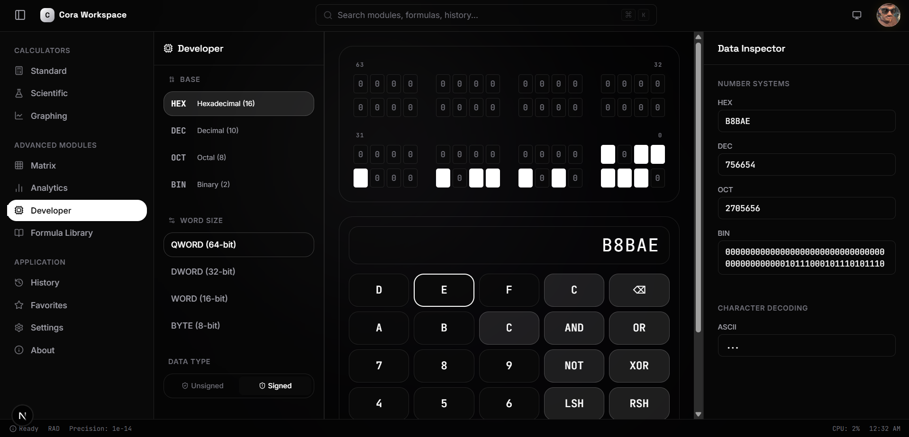
<p><em>Interactive 64-bit BitGrid, multi-base conversion engine, and character decoder.</em></p>

---

### 📚 Mathematical Formula Library
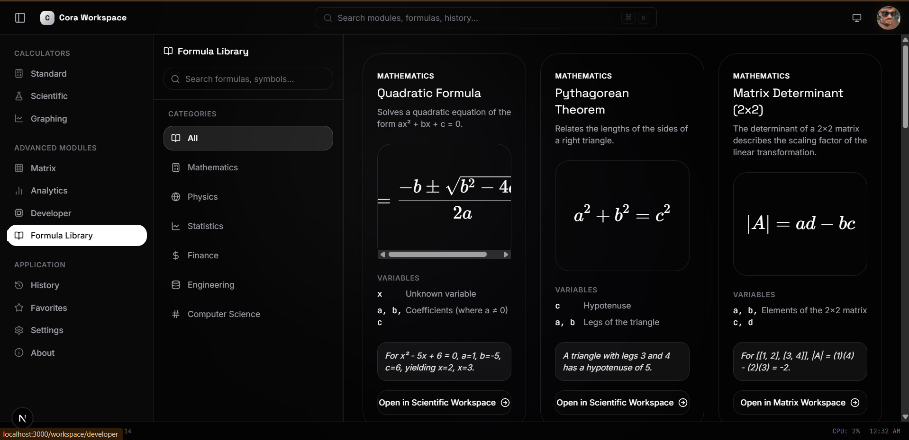
<p><em>Searchable KaTeX-rendered formula library organized by discipline with one-click calculators.</em></p>

---

### ⚙️ Workspace Settings & Theming
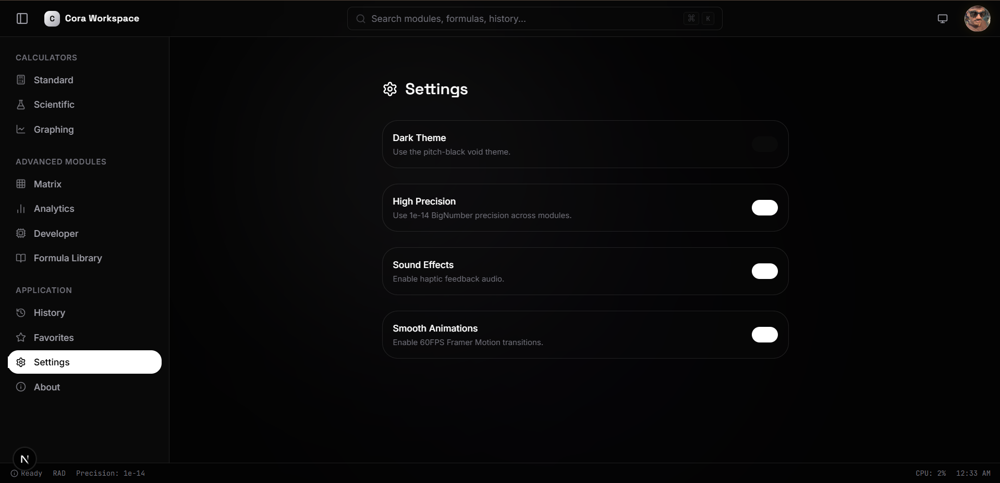
<p><em>Precision toggles, audio feedback controls, and dark/light system theme orchestration.</em></p>

---

### ℹ️ About Cora & Architecture
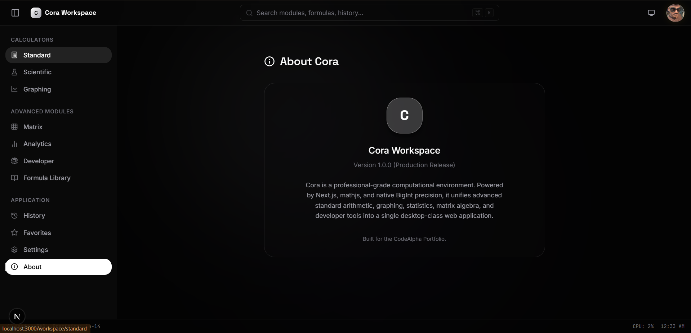
<p><em>Module architecture breakdown and project technical specifications.</em></p>

---

### 👨‍💻 Developer Profile
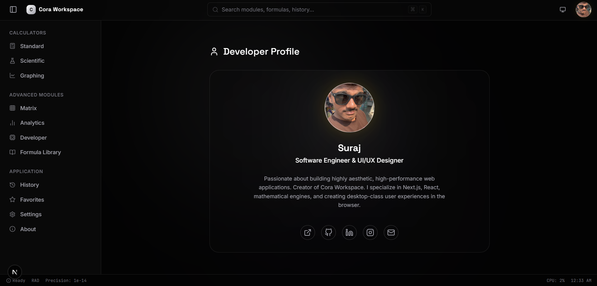
<p><em>Internship showcase profile and portfolio integrations.</em></p>

</div>

---

## 📱 Mobile-First Experience

Cora was designed from the ground up to feel like a native mobile application on handheld devices rather than a shrunk-down desktop site:

* **Slide-Out Navigation Drawer:** Sidebar smoothly collapses into an off-canvas glassmorphic drawer on screens `< 768px`.
* **Touch-Optimized Hit Targets:** Every button strictly adheres to the Apple HIG and Material Design `44×44px` minimum touch target standard.
* **Bottom Sheet Overlays:** Secondary panels and equation sidebars morph into swipeable bottom sheets on smartphones.
* **iOS Auto-Zoom Prevention:** Form inputs enforce `16px` base sizing to prevent unwanted browser zoom shifts on Safari iOS.
* **Responsive Scroll Containers:** Matrix grids, BitGrids, and Analytics tables feature protected horizontal scroll zones with hidden native scrollbars.
* **Full-Screen Command Palette:** Search overlay expands to comfortable full-screen mobile search on mobile viewports.

---

## 🏗️ Architecture & Engineering

```
CodeAlpha_Cora/
├── src/
│   ├── app/                         # Next.js 15 App Router Routes
│   │   ├── globals.css              # Tailwind CSS v4 Theme & Tokens
│   │   ├── layout.tsx               # Root Layout with ThemeProvider
│   │   ├── page.tsx                 # Landing Page Route
│   │   └── workspace/               # Computational Workspace Suite
│   │       ├── standard/            # Standard Calculator Module
│   │       ├── scientific/          # Scientific Calculator Module
│   │       ├── graphing/            # Graphing Canvas Module
│   │       ├── matrix/              # Matrix & Linear Algebra Module
│   │       ├── analytics/           # Statistics & Finance Module
│   │       ├── developer/           # Developer & BitGrid Module
│   │       ├── library/             # Formula Library Module
│   │       ├── history/             # Calculation History Sheet
│   │       ├── settings/            # Workspace Settings Modal
│   │       └── portfolio/           # Developer Profile Page
│   ├── components/ui/               # Reusable Atoms (Button, GlassCard, Layout)
│   ├── features/                    # Feature Slices (Landing, Workspace Modules)
│   ├── store/                       # Zustand Global State Slices
│   ├── lib/                         # Mathematical & Parsing Engines
│   └── data/                        # Curated Scientific Formula Datasets
└── public/
    ├── docs/                        # High-Resolution Showcase Assets
    └── logo.png                     # Official Cora Vector Brandmark
```

### Engineering Highlights
1. **Modular Zustand Stores:** State is compartmentalized into lightweight slices (`calcStore`, `graphStore`, `matrixStore`, `developerStore`, `analyticsStore`, `workspaceStore`), eliminating unnecessary re-renders.
2. **Safe Math Execution:** Expression evaluation uses AST (Abstract Syntax Tree) compilation and validation to guard against runtime code injection.
3. **Optimized Bundle Splitting:** Canvas-heavy and Three.js modules are dynamically loaded via `next/dynamic` with SSR disabled, keeping the first-load JS bundle under `165 kB`.
4. **Resilient Vercel CI/CD:** Customized `.npmrc` configuration ensuring seamless builds with React 19 peer dependency resolution.

---

## 💻 Tech Stack

| Domain | Technology | Description |
| :--- | :--- | :--- |
| **Framework** | [Next.js 15.5](https://nextjs.org/) | App Router, Server Components & Turbopack |
| **Library** | [React 19.1](https://react.dev/) | Modern concurrent React primitives |
| **Language** | [TypeScript 5](https://www.typescriptlang.org/) | Strict type safety across all mathematical models |
| **Styling** | [Tailwind CSS v4](https://tailwindcss.com/) | Modern CSS tokens & fluid layout utilities |
| **3D Graphics** | [Three.js](https://threejs.org/) & [R3F](https://r3f.docs.pmnd.rs/) | GPU-accelerated WebGL scene & cosmic shaders |
| **Motion** | [Framer Motion 12](https://www.framer.com/motion/) | 60fps spring transitions & layout animations |
| **State** | [Zustand 5](https://zustand.docs.pmnd.rs/) | Minimalist reactive state architecture |
| **Math Engine** | [Math.js 15](https://mathjs.org/) | BigNumber arbitrary precision AST parser |
| **Typography** | [KaTeX](https://katex.org/) | High-speed LaTeX mathematical typesetting |
| **Charts** | [Recharts](https://recharts.org/) | Responsive SVG data visualization |
| **Icons** | [Lucide React](https://lucide.dev/) | Clean, consistent vector iconography |

---

## ⌨️ Global Shortcuts

| Shortcut | Action | Scope |
| :--- | :--- | :--- |
| <kbd>⌘ K</kbd> / <kbd>Ctrl K</kbd> | Toggle Command Palette | Global |
| <kbd>Esc</kbd> | Dismiss Command Palette / Modals | Global |
| <kbd>Enter</kbd> / <kbd>=</kbd> | Execute Calculation | Calculator Modules |
| <kbd>Backspace</kbd> | Delete Last Character | Calculator Modules |
| <kbd>C</kbd> | Clear Expression | Calculator Modules |

---

## ⚙️ Getting Started

### Prerequisites
* **Node.js** `v18.18.0` or later
* **npm** or **pnpm**

### Installation

1. Clone the repository:
   ```bash
   git clone https://github.com/daystar-1nine/CodeAlpha_Cora.git
   cd CodeAlpha_Cora
   ```

2. Install dependencies:
   ```bash
   npm install
   ```

3. Launch development server:
   ```bash
   npm run dev
   ```

4. Open your browser:
   ```
   http://localhost:3000
   ```

### Production Build
To create an optimized production build:
```bash
npm run build
npm run start
```

---

## 🛡️ License & Attribution

Designed and developed by **Suraj** for the **CodeAlpha Internship Program**.

* **Live Demo:** [https://cora-wine.vercel.app/](https://cora-wine.vercel.app/)
* **Repository:** [github.com/daystar-1nine/CodeAlpha_Cora](https://github.com/daystar-1nine/CodeAlpha_Cora)

<div align="center">
  <sub>Engineered with precision, passion, and elegance.</sub>
</div>
